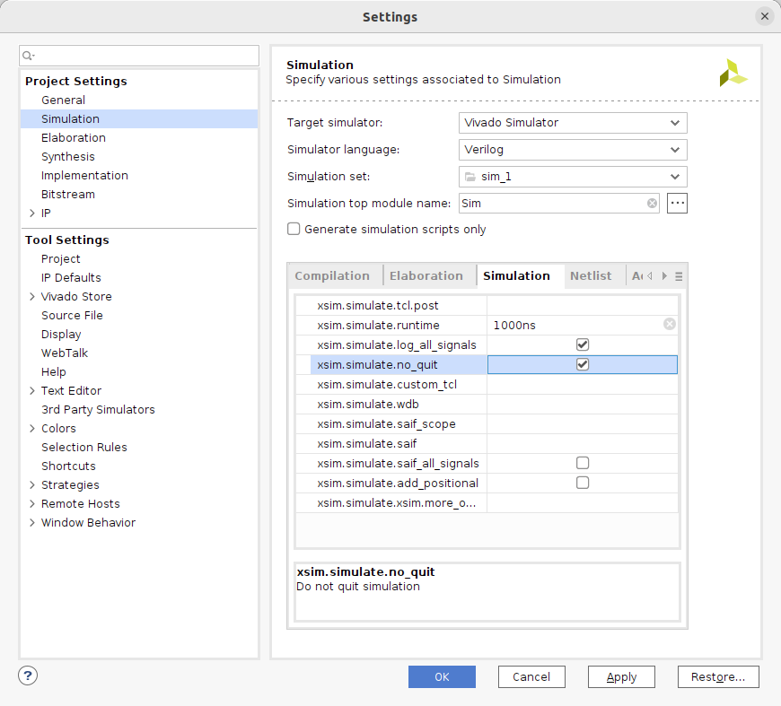
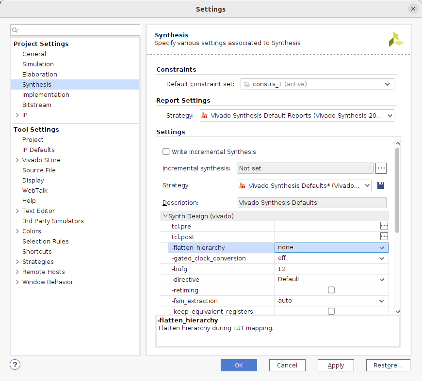
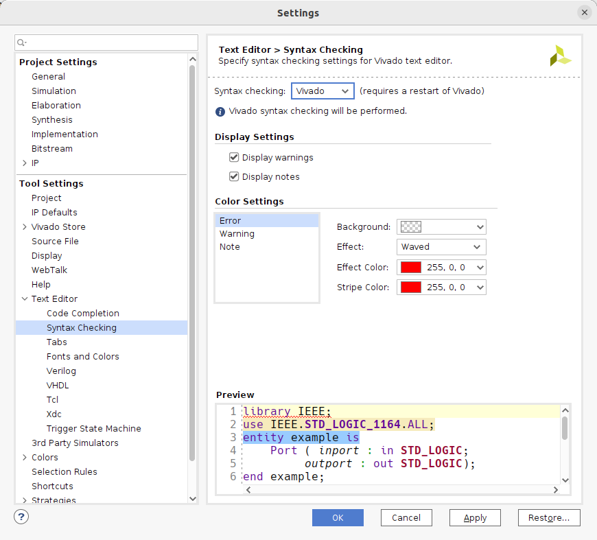
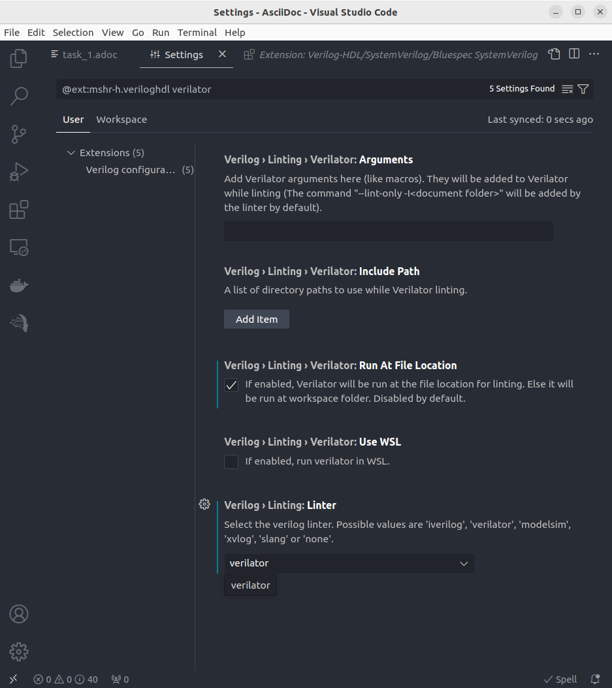
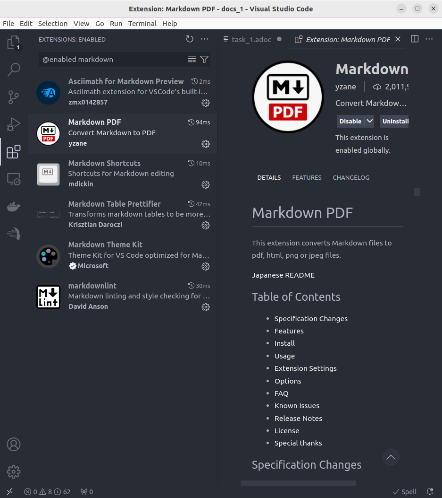
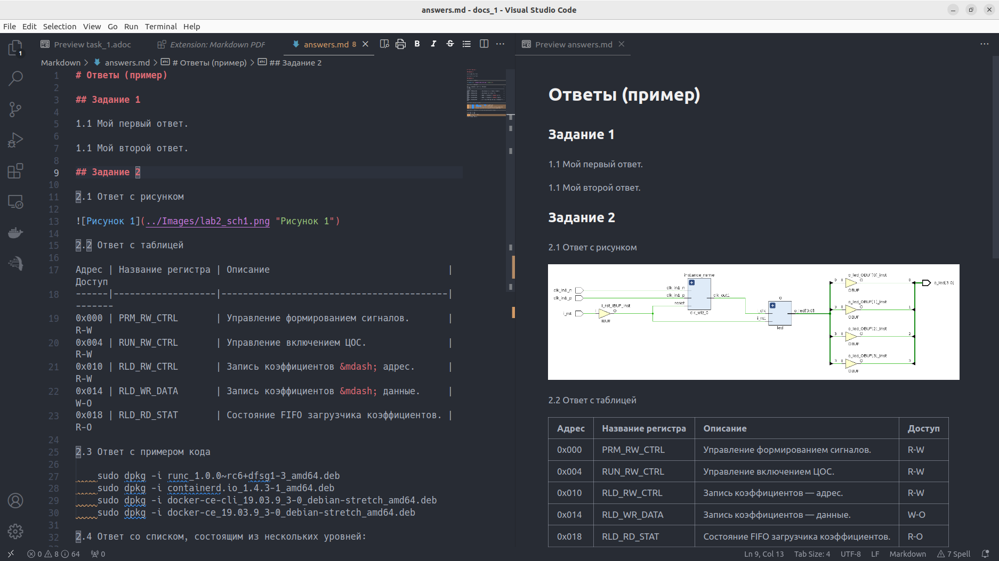
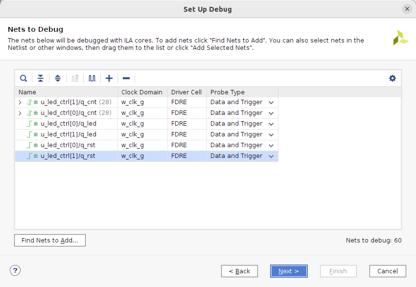
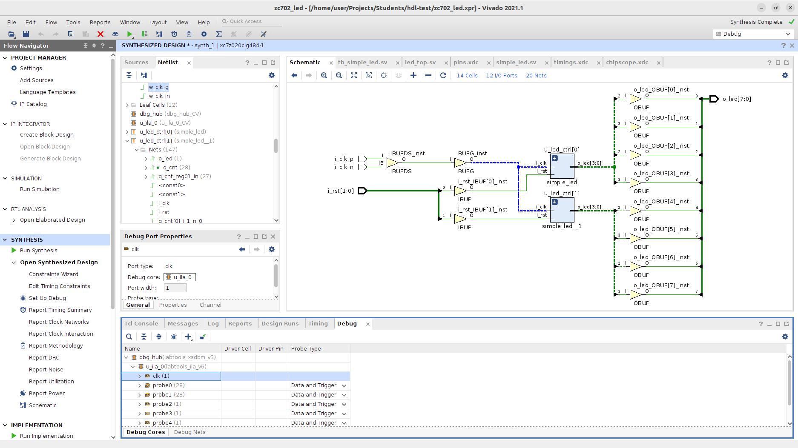
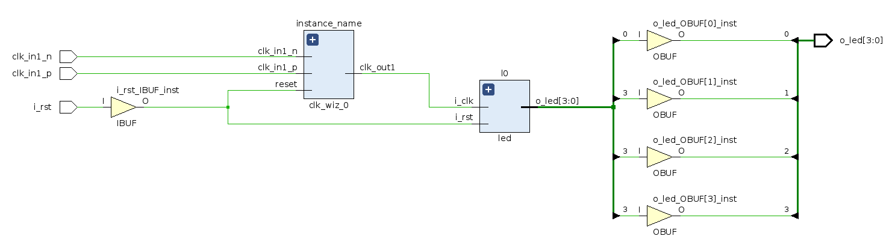
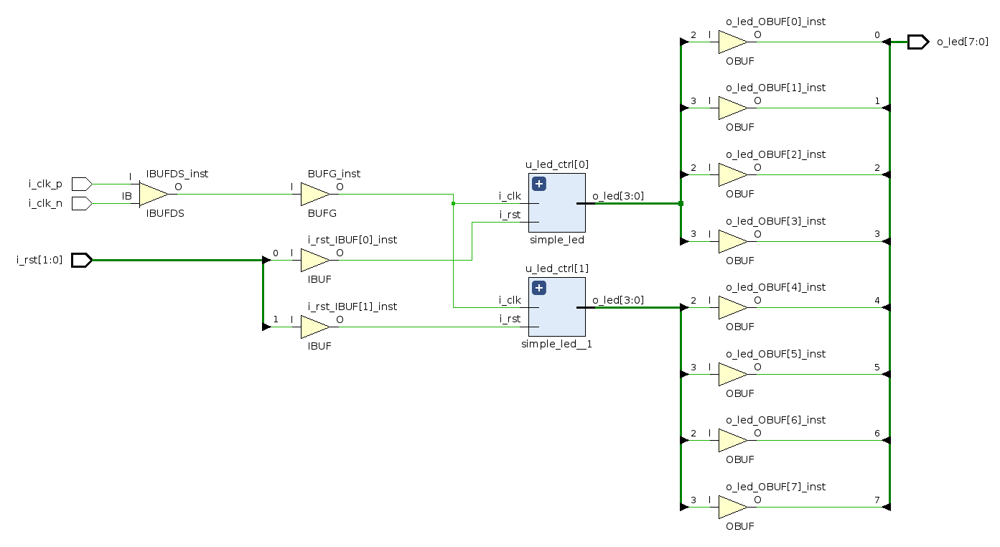

[.text-justify]
= Задания, v{revnumber}
:source-highlighter: coderay
:toc:
:toclevels: 3
:sectnums:
:pagenums:
:last-update-label!:
:toc-title: Содержание
:sect-caption: Разд.
:section-refsig: Разд.
:table-caption: Табл.
:figure-caption: Рис.
:chapter-signifier:
:chapter-refsig: Разд.
:part-signifier:
:part-refsig: Часть
:xrefstyle: full
:stem:
:pdf-page-layout: portrait
:doctype: article
:author: Кулешов М.В.
:email: kuleshov_mv@lemz-t.ru
:version-label: Версия
:revdate: {docdate}
:revnumber: 1.0
:revremark: Добавляю первое "домашнее задание".

== Введение

Новая методика работы:

* все лабораторные для платы ZC702 выполняются в одном проекте Vivado;
* этот проект и ответы на проверочные вопросы каждый студент выкладывает в свой персональный репозиторий в github;
* ответы предпочтительно выкладывать тоже в общий документ на языке разметки Markdown (например), ниже приведён пример. 

== Vivado

Столкнулись с рядом проблем, что нужно обязательно сделать.

=== Установить драйвер для USB-кабеля

[source,bash,linenums]
----
sudo {путь_до_установочной_директории_Vivado}/data/xicom/
cable_drivers/lin64/install_script/install_drivers/install_drivers

----

=== Настроить GUI Vivado

Нужно включить отображение всех сигналов в симуляторе, отключить перестройку иерархии в синтезе и заменить линтер Sigasi на Vivado в настройках текстового редактора.

[cols="2",frame=none,grid=none]
|===
a|

a|

2+a|

|===

== Visual Studio Code

Для удобства работы предлагаю альтернативу встроенному текстовому редактору Vivado -- VSCode (или аналоги).

Что для этого нужно:

* установить следующее расширение в VSCode

----
Name: Verilog-HDL/SystemVerilog/Bluespec SystemVerilog
Id: mshr-h.veriloghdl
Description: Verilog-HDL/SystemVerilog/Bluespec SystemVerilog support for VS Code
Version: 1.13.5
Publisher: Masahiro Hiramori
VS Marketplace Link: https://marketplace.visualstudio.com/items?itemName=mshr-h.VerilogHDL
----

* установить верилятор

----
sudo apt-get install verilator
----

* выбрать верилятор в настройках расширения

Отпишитесь, получилось или нет -- у меня подчёркивает ошибки в коде после сохранения SV-документа.
Есть и более продвинутые варианты для работы с проектами,
но этот -- самый простой для первого знакомства и использования в качестве "блокнота" фактически.

== GitHub

В целом, следуйте инструкциям на сайте.
И нужно установить `git`, если его нет.
Чуть более подробно:

* создайте учётную запись;
* создайте, добавьте в менеджер ключей и на сайт github ssh-ключ +
(https://docs.github.com/ru/authentication/connecting-to-github-with-ssh/generating-a-new-ssh-key-and-adding-it-to-the-ssh-agent);
* не совсем понял, обязательно ли сейчас создавать токен, но на всякий случай создал +
(https://docs.github.com/ru/authentication/keeping-your-account-and-data-secure/managing-your-personal-access-tokens);
* также для удобства работы можете установить `gh` и залогиниться там +
(https://docs.github.com/en/enterprise-cloud@latest/github-cli/github-cli/quickstart);
* устанавливайте GitHub Desktop +
(https://github.com/shiftkey/desktop)
* создайте пустой публичный проект, клонируйте его к себе на диск через GHDesktop;
* копируйте туда свой Vivado проект, сохраняйте изменения и пушьте их на сервер.

Пример моего проекта: https://github.com/subject-name-here-00/hdl-test.

Обратите внимание: в git нужно отслеживать только папку *.srcs и даже в ней не все файлы.
Например, из папок с IP нужно сохранять только XCI-файлы.
Изучите как работает .giignore файл, используйте мой в качестве примера.
С правильно настроенным gitignore вы должны видеть в проекте только файлы, которые сами создали: SV, XDC (опционально добавляются XCI, TCL и пр.).

== Markdown

Популярный и очень простой язык разметки.
Документы, написанные на нём, хорошо отслеживаются системами контроля версий (в отличие от бинарных doc-файлов, например).

Пример документа с основными конструкциями, которые вам могут потребоваться:
https://github.com/subject-name-here-00/hdl-test/blob/main/zc702_led.srcs/docs_1/Markdown/answers.md

Если пройдёте по ссылке и откроете документ на сайте GitHub, то увидите, что там доступно превью форматированного содержимого документа, а не просто строчки кода.

Так же MD-документы можно экспортировать в PDF через VSCode, я для этого пользуюсь расширением

----
Name: Markdown PDF
Id: yzane.markdown-pdf
Description: Convert Markdown to PDF
Version: 1.5.0
Publisher: yzane
VS Marketplace Link: https://marketplace.visualstudio.com/items?itemName=yzane.markdown-pdf
----

На всякий случай привожу снимок со всеми установленными расширениями.
Для того чтобы включить превью MD-документа в VSCode используется комбинация `Shift+Ctrl+V`.
Чтобы вызвать консоль со списком доступных для данного типа файлов операций, нужно нажать `F1`.

== ILA: отладка "в железе"

ILA -- integrated logic analyzer, так же известный как chipscope в старой версии САПР или debug core.
Это программный осциллограф, который позволяет через JTAG смотреть сигналы в ПЛИС.

Пример добавления чипскопа:
https://github.com/subject-name-here-00/hdl-test/commit/86e8912fe758d431bbd3bde457cf70f2f53c3db9

Разберём по шагам:

. Добавляем в начало строки с объявлением сигнала (как i/o порта, так и переменной) атрибут `(* MARK_DEBUG="true" *)`.
. Создаём новый XDC-файл в констрейны (в моём примере -- chipscope.xdc), отмечаем его ПКМ -> Set as Target Constrain File. +
Теперь, когда мы внесём изменения в констрейны проекта в синтезе, эти изменения сохранятся именно в этот файл.
. Запускаем синтез, когда он завершён -- выбираем на панели слева Synthesis -> Open Synthesized Design -> Set Up Debug.
. В открывшемся окне отмечаем необходимые сигналы, задаём необходимый размер буфера сигналов (т.е. количество отсчётов на экране осциллографа).
. Когда окно закроется, нужно установить курсор во вкладку на нижней панели и нажать `Ctrl+S`, чтобы сохранить изменения.
. Открываем chipscope.xdc и убеждаемся, что изменения сохранились (может потребоваться закрыть и открыть файл заново для обновления).

На схеме сигналы, отмеченные `mark_debug`, помечаются иконкой с жучком.

ILA сохраняется в проекте под названием вида "ILA_0", после сборки битстрима и прошивки ПЛИС в Hardware Manager в списке устройств появится соответствующая строчка.
Работа с осциллографом похожа на работу с окном Waveform симулятора.

== Лабораторная работа №1

[%header,cols="^1,^2",width=75%,align="center"]
.Индивидуальные задания
|===
^|Студенты ^|Задания

|Вадим, Григорий
|Лаб. №1, задание 1 (с.36)

|Владислава, Семён
|Лаб. №2, задание 2 (с.37)
|===

Потренируйтесь использовать `case` или булеву алгебру перед переходом к конечным автоматам.
Можете реализовать мультиплексор через неблокирующие присвоения.
Составьте тестбенч для проверки:

* проверить каждое состояние селектора,
* между переключениями селектора должно пройти несколько периодов самого "медленного" сигнала, чтобы убедиться, что мы видим именно выбранный вход на выходе.

== Лабораторная работа №2

=== Основное задание

Я ориентируюсь на документ "Лаб№2_упр_светод.docx".
Создавайте модуль по инструкциям из лабораторной работы.
В качестве платы в проекте указывайте ZC702, все параметры (пины и пр) берите для неё из соответствующей документации.

Чтобы адаптировать лабораторную работу для этой платы придётся внести небольшие изменения.
Я предлагаю добавить внешний топ-модуль ("враппер"), в котором реализовать преобразование дифференциального внешнего клока.
В диалог сегодня скидывал вариант с IBUFDS и BUFG.
Альтернатива -- добавить в проект Clocking Wizard IP.
Все настройки в таком случае можно оставить по умолчанию.

=== Дополнительные задания и вопросы

Первые 4 вопроса распределим как индивидуальные задания, которые нужно реализовать в коде.
Здесь используйте систему контроля версий:

* сперва выполнили и сохранили основное задание лабораторной работы (с.17, п.2.8);
* потом выполнили и так же сохранили в git индивидуальное задание.

Битстримы (bit-файлы) для каждого этапа можете переименовать и сохранить в отдельной папке.
Каждый раз когда вы запускаете имплементацию -- последний битстрим удаляется (но пока у нас небольшие проекты, так что это нестрашно).

Дополнительное усложнение задания: на плате  ZC702 доступно не 4, а 8 светодиодов в ряд.

* добавьте в топ-модуль вторую копию модуля, отвечающего за мигание светодиодами,
* выходы первого назначены на ножки [3:0], второго -- [7:4],
* на вход первого подаётся ресет с кнопки SW5 (left), а второго -- c SW7 (right).

Для копирования модулей в SV можно использовать синтаксис, похожий на объявление массивов.
Синтезатор обычно очень хорошо понимает, что от него требуется, и автоматически распределяет сигналы согласно их разрядности.
Так, в моём примере,

* одно-битный `i_clk` разветвляется на оба модуля,
* младший бит `rst` автоматически подаётся на первый модуль, а старший -- на второй,
* аналогично выходная шина делится пополам между двумя модулями.

Синтаксис смотрите в файле https://github.com/subject-name-here-00/hdl-test/blob/main/zc702_led.srcs/sources_1/new/led_top.sv.
Будьте осторожны, проверяйте результаты в симуляции и синтезе, потому что SV очень гибок в этом отношении и при ошибке в коде может скрытно (без сообщения об ошибке) разрешить эту проблему совсем не таким образом, как вы себе представляли.

Затем я хочу, чтобы вы добавили в проект ILA и собрали битстрим с ним (инструкция приводилась выше).
В ILA обязательно нужно добавить ресет, счётчик и шину сигналов, подаваемых на светодиоды.

[%header,cols="^1,^6",width=100%,align="center"]
.Индивидуальные задания
|===
^|Студенты ^|Задания

|Вадим
|Лаб. №2, задание 1.1 (с.19): дать короткий письменный ответ, обновить алгоритм мигания светодиода.

|Владислава
|Лаб. №2, задание 1.2 (с.19): новые сигналы (детекторы фронтов) добавить в ILA.

|Григорий
|Лаб. №2, задание 1.3 (с.19): обновить алгоритм мигания светодиода.

|Семён
|Лаб. №2, задание 1.4 (с.19): обновить алгоритм мигания светодиода.
|===

На прочие вопросы нужно дать ответ в свободной форме, написать небольшой фрагмент кода или приложить снимок.

[%header,cols="1,2",width=75%,align="center"]
.Общие задания
|===
^|Задания ^|Формат ответа
|1.6      |пропуск
|1.6      |ответ (по аналогии из SV)
|1.7      |пропуск
|1.8      |ответ
|2.1      |ответ (вкратце)
|2.2      |пропуск
|3.1, 3.2 |обсуждение в офисе
|3.3-3.5  |ответ
|4.1      |обсуждение в офисе
|4.2-4.3  |ответ
|5.1, 5.2 |ответ (вкратце)
|6.1-6.4  |ответ
|===

На "устные" тоже приготовьтесь дать ответ!
