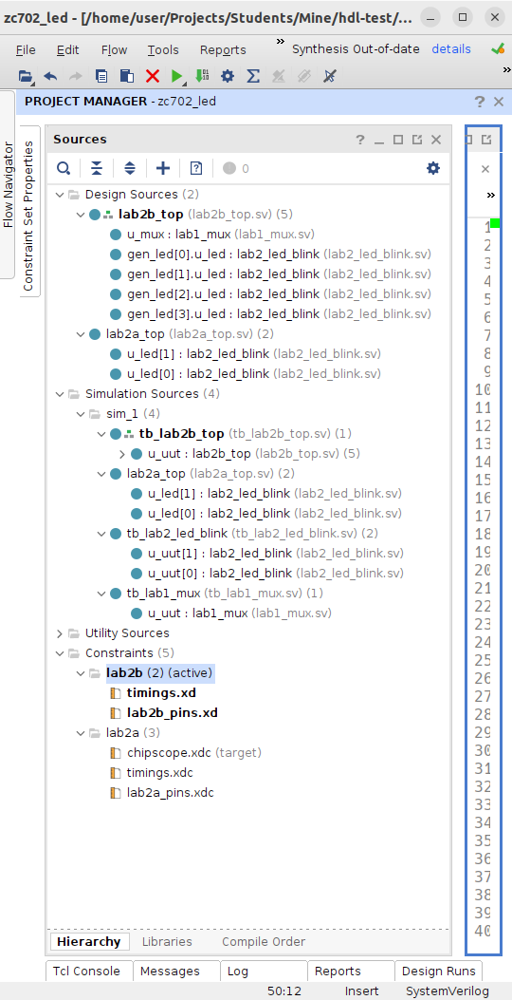
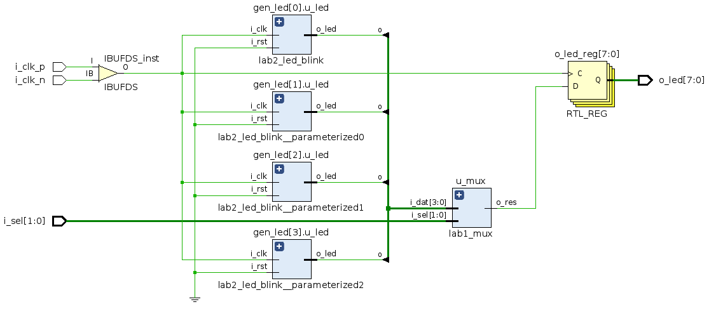
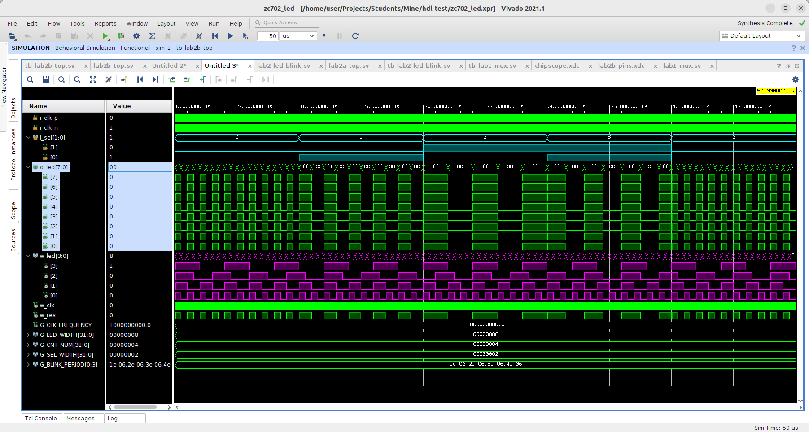

[.text-justify]
= Задания, v{revnumber}
:source-highlighter: coderay
:toc:
:toclevels: 3
:sectnums:
:pagenums:
:last-update-label!:
:toc-title: Содержание
:sect-caption: Разд.
:section-refsig: Разд.
:table-caption: Табл.
:figure-caption: Рис.
:chapter-signifier:
:chapter-refsig: Разд.
:part-signifier:
:part-refsig: Часть
:xrefstyle: full
:stem:
:pdf-page-layout: portrait
:doctype: article
:author: Кулешов М.В.
:email: kuleshov_mv@lemz-t.ru
:version-label: Версия
:revdate: {docdate}
:revnumber: 1.3
:revremark: SystemVerilog стиль (рекомендации).

== Введение

Новая методика работы:

* все лабораторные для платы ZC702 выполняются в одном проекте Vivado;
* этот проект и ответы на проверочные вопросы каждый студент выкладывает в свой персональный репозиторий в github;
* ответы предпочтительно выкладывать тоже в общий документ на языке разметки Markdown (например), ниже приведён пример. 

== Vivado

Столкнулись с рядом проблем, что нужно обязательно сделать.

=== Установить драйвер для USB-кабеля

----
sudo {путь_до_установочной_директории_Vivado}/data/xicom/
cable_drivers/lin64/install_script/install_drivers/install_drivers
----

=== Настроить GUI Vivado

Нужно включить отображение всех сигналов в симуляторе, отключить перестройку иерархии в синтезе и заменить линтер Sigasi на Vivado в настройках текстового редактора.

[cols="2",frame=none,grid=none]
|===
a|
image::../Images/vivado_sim.png[title=Настройки симулятора]
a|
image::../Images/vivado_synth.png[title=Настройки синтеза]
2+a|
image::../Images/vivado_linter.png[title=Настройки линтера,width=50%,align="center"]
|===

== Visual Studio Code

Для удобства работы предлагаю альтернативу встроенному текстовому редактору Vivado -- VSCode (или аналоги).

Что для этого нужно:

* установить следующее расширение в VSCode

----
Name: Verilog-HDL/SystemVerilog/Bluespec SystemVerilog
Id: mshr-h.veriloghdl
Description: Verilog-HDL/SystemVerilog/Bluespec SystemVerilog support for VS Code
Version: 1.13.5
Publisher: Masahiro Hiramori
VS Marketplace Link: https://marketplace.visualstudio.com/items?itemName=mshr-h.VerilogHDL
----

* установить верилятор

----
sudo apt-get install verilator
----

* выбрать верилятор в настройках расширения

image::../Images/vscode_verilator.png[title=Настройки VSCode,width=50%,align="center"]

Отпишитесь, получилось или нет -- у меня подчёркивает ошибки в коде после сохранения SV-документа.
Есть и более продвинутые варианты для работы с проектами,
но этот -- самый простой для первого знакомства и использования в качестве "блокнота" фактически.

== GitHub

В целом, следуйте инструкциям на сайте.
И нужно установить `git`, если его нет.
Чуть более подробно:

* создайте учётную запись;
* создайте, добавьте в менеджер ключей и на сайт github ssh-ключ +
(https://docs.github.com/ru/authentication/connecting-to-github-with-ssh/generating-a-new-ssh-key-and-adding-it-to-the-ssh-agent);
* не совсем понял, обязательно ли сейчас создавать токен, но на всякий случай создал +
(https://docs.github.com/ru/authentication/keeping-your-account-and-data-secure/managing-your-personal-access-tokens);
* также для удобства работы можете установить `gh` и залогиниться там +
(https://docs.github.com/en/enterprise-cloud@latest/github-cli/github-cli/quickstart);
* устанавливайте GitHub Desktop +
(https://github.com/shiftkey/desktop)
* создайте пустой публичный проект, клонируйте его к себе на диск через GHDesktop;
* копируйте туда свой Vivado проект, сохраняйте изменения и пушьте их на сервер.

Пример моего проекта: https://github.com/subject-name-here-00/hdl-test.

Обратите внимание: в git нужно отслеживать только папку ./*.srcs -- и даже в ней не все файлы.
Например, из папок с IP нужно сохранять только XCI-файлы.
Изучите как работает .gitignore файл, используйте мой в качестве примера.
С правильно настроенным gitignore вы должны видеть в проекте только файлы, которые сами создали: SV, XDC (опционально добавляются XCI, TCL и пр.).

== Markdown

Популярный и очень простой язык разметки.
Документы, написанные на нём, хорошо отслеживаются системами контроля версий (в отличие от бинарных doc-файлов, например).

Пример документа с основными конструкциями, которые вам могут потребоваться:
https://github.com/subject-name-here-00/hdl-test/blob/main/zc702_led.srcs/docs_1/Markdown/answers.md

Если пройдёте по ссылке и откроете документ на сайте GitHub, то увидите, что там доступно превью форматированного содержимого документа, а не просто строчки кода.

Так же MD-документы можно экспортировать в PDF через VSCode, я для этого пользуюсь расширением

----
Name: Markdown PDF
Id: yzane.markdown-pdf
Description: Convert Markdown to PDF
Version: 1.5.0
Publisher: yzane
VS Marketplace Link: https://marketplace.visualstudio.com/items?itemName=yzane.markdown-pdf
----

image::../Images/markdown_extensions.png[title=Все (избыточные) расширения для работы с Markdown,width=50%,align="center"]

На всякий случай привожу снимок со всеми установленными расширениями.
Для того чтобы включить превью MD-документа в VSCode используется комбинация `Shift+Ctrl+V`.
Чтобы вызвать консоль со списком доступных для данного типа файлов операций, нужно нажать `F1`.

image::../Images/markdown_example.png[title=Пример редактирования Markdown в VSCode]

== ILA: отладка "в железе"

ILA -- integrated logic analyzer, так же известный как chipscope в старой версии САПР или debug core.
Это программный осциллограф, который позволяет через JTAG смотреть сигналы в ПЛИС.

Пример добавления чипскопа:
https://github.com/subject-name-here-00/hdl-test/commit/86e8912fe758d431bbd3bde457cf70f2f53c3db9

Разберём по шагам:

. Добавляем в начало строки с объявлением сигнала (как i/o порта, так и переменной) атрибут `(* MARK_DEBUG="true" *)`.
. Создаём новый XDC-файл в констрейнтах (в моём примере -- chipscope.xdc), отмечаем его ПКМ -> Set as Target Constrain File. +
Теперь, когда мы внесём изменения в констрейнты проекта в синтезе, эти изменения сохранятся именно в этот файл.
. Запускаем синтез, когда он завершён -- выбираем на панели слева Synthesis -> Open Synthesized Design -> Set Up Debug.
. В открывшемся окне отмечаем необходимые сигналы, задаём необходимый размер буфера сигналов (т.е. количество отсчётов на экране осциллографа).
. Когда окно закроется, нужно установить курсор во вкладку на нижней панели и нажать `Ctrl+S`, чтобы сохранить изменения.
. Открываем chipscope.xdc и убеждаемся, что изменения сохранились (может потребоваться закрыть и открыть файл заново для обновления).

image::../Images/chipscope_1.png[title=Окно выбора сигналов для отладки,width=75%,align="center"]
image::../Images/chipscope_2.png[title=Окно применения изменений (нижняя панель),width=100%]

На схеме сигналы, отмеченные `mark_debug`, помечаются иконкой с жучком.

ILA сохраняется в проекте под названием вида "ILA_0", после сборки битстрима и прошивки ПЛИС в Hardware Manager в списке устройств появится соответствующая строчка.
Работа с осциллографом похожа на работу с окном Waveform симулятора.

== Экспорт/импорт Vivado проекта через TCL-скрипт [[pg_project_tcl]]

=== Экспорт

Для экспорта проекта нужно открыть TCL-консоль в Vivado, переместиться в директорию с проектом и выполнить команду с атрибутом "использовать относительные пути".

----
cd [get_property DIRECTORY [current_project]]
write_project_tcl -all_properties -no_copy_sources -paths_relative_to ./ -force ./<название проекта>.tcl

----

=== Импорт

Для импорта проекта нужно открыть TCL-консоль в Vivado, переместиться в git-репозиторий с TCL-скриптом и выполнить его оттуда.

----
cd <адрес git-репозитория>
source ./<название проекта>.tcl
----

С импортом всё равно пока возникают проблемы.
Временное решение: найти в TCL-файле строчку с объявлением переменной `$origin_dir` и исправить её на <адрес git-репозитория>, например:

----
# Set the reference directory for source file relative paths (by default the value is script directory path)
set origin_dir "/home/user/Projects/Students/Mine/hdl-test"
----

== SV Coding Style (дополняется) [[pg_code_style]]

В VSCode вроде бы можно настроить проверку стиля (? самостоятельное изучение).

=== Общие положения

. Используется только snake-case (signal_name), никогда camel-case (signalName).
. Uppercase используется практически без исключений только для констант.
Названия файлов, сигналов, типов и пр. -- lowercase.
. Комментарии только на английском, без применения особых символов (`deg` вместо &#176;, `Delta` вместо &#916; и так далее).

=== Префиксы

В рекомендациях в интернете аналогичные обозначения иногда используют как суффиксы,
но все инженеры, с которыми мне доводилось работать, использовали их как префиксы.

[header,cols="3,2,8"]
|===
^|Область ^|Префиксы ^|Обозначение 

.3+|Порты
|i_
|Входной порт (input).
|o_
|Выходной порт (output).
|b_
|Двунаправленный (bidirectional).

.2+|Сигналы
|q_
|Секвенциальная (sequential) логика ("Q" как выход D-триггера на схеме).
|w_
|Комбинационная (combinational) логика (cигналы типа `wire`).

.4+|Порты/сигналы
.2+|s_
|Порт: Slave/Subordinate-интерфейс (обычно вход).
|Сигнал: может быть регистром.
Иногда применяется для обозначения сигнала, подаваемого на вход вложенного модуля,
например, `s_ena`.
.2+|m_
|Порт: Master/Manager-интерфейс (обычно выход).
|Сигнал: только `wire`.
Иногда применяется для обозначения сигнала с выхода вложенного модуля,
например, `m_clk`.

.2+|Константы
|G_
|"Глобальные" константы: `generic` (VHDL), `parameter` (SV).
|C_
|"Локальные" константы: `constant` (VHDL), `localparam` (SV).

.3+|Модули
|top
|Топ-модуль в иерархии проекта (необязательно префикс).
|tb_
|Тестбенч для модуля `<name>` обозначается `tb_<name>`.
|u_
a|
Объявление модуля (instantiation): "u" как unit.

----
name #(
	.A(A)
) u_name (
	.b(b)
);
----

|Типы
|t_
|Пользовательские типы данных.

|Функции
|f_
|Пользовательские функции.

|Интерфейсы
|if_
|--

|Блоки кодаfootnote:fn_code[Нужно присваивать обозначения для блоков кода, которые отображаются в иерархии проекта.]
|gen_
a|
----
generate for (...) begin : gen_name
	<some code here>
end gen_name endgenerate
----

|===

=== Источники

Есть такой гайд на русском языке: +
https://github.com/johan92/verilog-coding-style/blob/master/coding-style.md

Не со всем согласен: я очень люблю табы и размер отступа 4, например -- и это всё настраивается в настройках текстового редактора Vivado.

== Лабораторная работа №1

[%header,cols="^1,^2",width=75%,align="center"]
.Индивидуальные задания
|===
^|Студенты ^|Задания

|Вадим, Григорий
|Лаб. №1, задание 1 (с.36)

|Владислава, Семён
|Лаб. №1, задание 2 (с.37)
|===

Потренируйтесь использовать `case` или булеву алгебру перед переходом к конечным автоматам.
Можете реализовать мультиплексор через неблокирующие присвоения.
Составьте тестбенч для проверки:

* проверить каждое состояние селектора,
* между переключениями селектора должно пройти несколько периодов самого "медленного" сигнала, чтобы убедиться, что мы видим именно выбранный вход на выходе.

== Лабораторная работа №2

=== Основное задание

Я ориентируюсь на документ "Лаб№2_упр_светод.docx".
Создавайте модуль по инструкциям из лабораторной работы.
В качестве платы в проекте указывайте ZC702, все параметры (пины и пр) берите для неё из соответствующей документации.

Чтобы адаптировать лабораторную работу для этой платы придётся внести небольшие изменения.
Я предлагаю добавить внешний топ-модуль ("враппер"), в котором реализовать преобразование дифференциального внешнего клока.
В диалог сегодня скидывал вариант с IBUFDS и BUFG.
Альтернатива -- добавить в проект Clocking Wizard IP.
Все настройки в таком случае можно оставить по умолчанию.

image::../Images/lab2_sch1.png[title=Пример реализации Лаб2 с IP]

=== Дополнительные задания и вопросы (2a) [[pg_lab2a]]

Первые 4 вопроса распределим как индивидуальные задания, которые нужно реализовать в коде.
Здесь используйте систему контроля версий:

* сперва выполнили и сохранили основное задание лабораторной работы (с.17, п.2.8);
* потом выполнили и так же сохранили в git индивидуальное задание.

Битстримы (bit-файлы) для каждого этапа можете переименовать и сохранить в отдельной папке.
Каждый раз когда вы запускаете имплементацию -- последний битстрим удаляется (но пока у нас небольшие проекты, так что это нестрашно).

Дополнительное усложнение задания: на плате  ZC702 доступно не 4, а 8 светодиодов в ряд.

* добавьте в топ-модуль вторую копию модуля, отвечающего за мигание светодиодами,
* выходы первого назначены на ножки [3:0], второго -- [7:4],
* на вход первого подаётся ресет с кнопки SW5 (left), а второго -- c SW7 (right).

image::../Images/lab2_array_sch.png[title=Модуль управления светодиодами вставлен дважды (как массив)]

Для копирования модулей в SV можно использовать синтаксис, похожий на объявление массивов.
Синтезатор обычно очень хорошо понимает, что от него требуется, и автоматически распределяет сигналы согласно их разрядности.
Так, в моём примере,

* одно-битный `i_clk` разветвляется на оба модуля,
* младший бит `rst` автоматически подаётся на первый модуль, а старший -- на второй,
* аналогично выходная шина делится пополам между двумя модулями.

Синтаксис смотрите в файле
https://github.com/subject-name-here-00/hdl-test/blob/main/zc702_led.srcs/sources_1/new/led_top.sv.
Будьте осторожны, проверяйте результаты в симуляции и синтезе, потому что SV очень гибок в этом отношении и при ошибке в коде может скрытно (без сообщения об ошибке) разрешить эту проблему совсем не таким образом, как вы себе представляли.

Затем я хочу, чтобы вы добавили в проект ILA и собрали битстрим с ним (инструкция приводилась выше).
В ILA обязательно нужно добавить ресет, счётчик и шину сигналов, подаваемых на светодиоды.

[%header,cols="1,6",width=100%,align="center"]
.Индивидуальные задания
|===
^|Студенты ^|Задания

|Вадим
|Лаб. №2, №1.1 (с.19): дать короткий письменный ответ, обновить алгоритм мигания светодиода.

|Владислава
|Лаб. №2, №1.2 (с.19): новые сигналы (детекторы фронтов) добавить в ILA.

|Григорий
|Лаб. №2, №1.3 (с.19): обновить алгоритм мигания светодиода.

|Семён
|Лаб. №2, №1.4 (с.19): обновить алгоритм мигания светодиода.
|===

На прочие вопросы нужно дать ответ в свободной форме, написать небольшой фрагмент кода или приложить снимок.

[%header,cols="1,2",width=75%,align="center"]
.Общие задания
|===
^|Задания ^|Формат ответа
|1.6      |пропуск
|1.6      |ответ (по аналогии из SV)
|1.7      |пропуск
|1.8      |ответ
|2.1      |ответ (вкратце)
|2.2      |пропуск
|3.1, 3.2 |обсуждение в офисе
|3.3-3.5  |ответ
|4.1      |обсуждение в офисе
|4.2-4.3  |ответ
|5.1, 5.2 |ответ (вкратце)
|6.1-6.4  |ответ
|===

На "устные" тоже приготовьтесь дать ответ!

== Лабораторная работа №2.5 (2b)

Это последнее обращение к этой лабораторной, обещаю.

=== Подведение итогов по пройденному

Мы успели познакомиться с основными понятиями и некоторыми методиками.
Отдельно остановимся на двух из них.

==== Вычисление необходимой разрядности сигнала. [[pg-radix]]

Если переменная может принимать _N_ значений или изменяется от 0 до _N_&#8722;1, то её разрядность _W_ (width, реже length или radix) вычисляется по формуле 2^_W_^ &#8805; _N_.
Следовательно, _W_ = сeil(log~2~(_N_)), где ceil -- округление до целого в большую сторону.

Рассмотрим пример: по заданию, счётчик сбрасывается, когда доходит до значения 200, то есть _N_&#8722;1 = 200.
Соответственно, нам нужен счётчик разрядностью log~2~(200 + 1) ~= 7,65 => 8.
Проверяем: 2^8^ = 256, 256 > 200 -- следовательно, 8-битный счётчик может принимать значения от 0 до 2^_W_^&#8722;1 => 255. Так как его максимальное значение должно быть ограничено 200, то мы не можем позволить ему переполняться "естественным" образом -- нужно добавить сброс как в основном задании второй лабораторной (модуль _led_blink_):

----
q_cnt <= (q_cnt <= 200) ? q_cnt + 1 : '0;
----

==== Повторное использование модулей

Отдельные модули -- это просто фрагмент кода, который вы можете использовать столько раз сколько потребуется.

Во второй лабораторной работе вы написали модуль _led_blink_, чтобы мигать несколькими светодиодами особым образом.

В дополнительном задании к ней (2a) вы решили следующую задачу:
мы хотим выделить на плате две независимые группы светодиодов с независимым управлением (в этом случае -- сбросом) по кнопке.
В этом случае для этого было достаточно повторно объявить _led_blink_ в топ-модуле проекта и подвести к нему ресет со второй кнопки.

Почему мы сделали это через массив?
Нужно всегда стремиться к параметризации.
Что если бы модуль требовалось повторить не два раза, а несколько десятков раз?
Если бы в разных проектах требовалось разное количество модулей (на одной плате 4 светодиода, на другой 8, на третьей 20 и так далее)?
Здесь это решается подстановкой одного числа, логика работы вовлечённых модулей не нуждается в исправлении.
Количество кода по сравнению с использованием одного модуля практически не увеличивается.

В проектах часто встречаются модули-"строительные кирпичики" -- сумматор, умножитель, аккумулятор, сдвиговый регистр и пр. -- которые выполняют только одну арифметическую или логическую операцию, но многократно вызываются с разными параметрами для разных задач.
Блоки FIFO -- ещё один распространённый универсальный модуль.

=== Рефакторинг архитектуры

Проверил предыдущие работы и хочу сделать несколько замечаний по ведению проектов.
Если вы продолжите работать в отрасли, то, безусловно, со временем выработаете свой собственный стиль, но сейчас я хотел бы привести всех к использованию единой системы обозначений.
Или хотя бы единообразной во всём проекте.

Что нужно сделать. Заканчивайте Лаб.2(a) (доп.задание из предыдущего раздела), обновляйте TCL-проекта по инструкции из раздела <<pg_project_tcl>>, сохраняйте все изменения в git.

Теперь про проект (следующие пункты не выполняются по порядку, а применяются как бы все одновременно), пример можете посмотреть на снимке архитектуры моего проекта:

* Все модули должны лежать в отдельных SV-файлах (в качестве компромисса могу предложить завести модуль _draft.sv_ для быстрой проверки каких-то языковых конструкций).
* У модулей должна быть единая система обозначений в виде префиксов, показывающих, к какой лабораторной работе они относятся. Мой вариант несколько громоздкий: _lab1_, _lab2_, _lab2a_ (первое доп.задание из предыдущего раздела), _lab2b_ (новое задание, которое будет описано ниже в этом разделе) -- выбирайте на своё усмотрение, но придерживайтесь аналогичной нумерации.
* Модули с функционалом _mux_ (Лаб.1) и _led_blink_ (Лаб.2) должны быть объявлены в проекте только один раз, никаких _led_blink2_.
* Для Лаб.2(а) и Лаб.2(б) в проект должны быть добавлены два разных топ-модуля с обозначением _top_ в названии.
* У Лаб.2(а) и Лаб.2(б) должны быть два разных сета констрейнтов с названиями, отражающими их назначение.
* В проект должны быть добавлены тестбенчи для _mux_, _led_blink_ и топ-модуля Лаб.2(б). Остальные на ваше усмотрение.
* Лишние файлы удаляйте (если раньше сохранили в git).

=== Рефакторинг кода

Отдельные модули тоже подвергнутся изменениям.
В процессе выполнения код нужно почистить и привести в соответствие с рекомендациями из раздела <<pg_code_style>>.
Добавьте комментарии, где считаете необходимым (вам же потом могут пригодиться).
Убирайте лишние сигналы, оптимизируйте код.
Добавьте к модулям "шапку", в которой укажите

* дату последних изменений,
* версию модуля в формате X.Y: X -- мажорная версия (большие изменения, приводящие к потере обратной совместимости с прочими модулями и/или тестбенчем самого модуля), Y -- минорная версия (мелкие правки, исправление опечаток и пр.).
* своё имя (опционально).

Я пытался использовать в своём тестовом проекте стандартную шапку, предлагаемую при создании файла, но она мне очень не нравится, так что не буду никому навязывать.
Придумайте свою собственную, если хотите.

. Мультиплексор _mux_ -- параметризировать разрядность входных сигналов, при этом разрядность селектора зависит от разрядности шины данных.
Снова обращаемся к разделу <<pg-radix>>:

* Допустим, ширина входной шины данных равна 8.
Тогда селектор должен принимать значения от 0 до 7 -- какой он должен быть разрядности?
Эту зависимость нужно выразить формулой в коде.
* Если ширина входной шины не равна числу в степени двойки, то есть, не 1, 2, 4, 8 и так далее, а, например, 5 -- какой разрядности должен быть селектор?
Как исключить запрещённые значения 6 и 7, если использовать селектор как индекс в векторе?
Это исключение тоже нужно реализовать и проверить в ТБ.
* Просто замечание: вы можете проводить практически любые арифметические/логические операции над селектором-как-индексом, пока все члены выражения кроме самого селектора являются константами.
Например, если ширина шины данных равна 4, селектора -- 2, а выход -- 1 бит, то любые комбинации сигналов на входе будут реализованы в ПЛИС через один элемент LUT6.
Какую бы логику вы к ним ни прикрутили.
Переключение входов в обратном порядке: 
`o_res = i_dat[G_DAT_WIDTH - i_sel - 1];`

. Мигание светодиодом _led_blink_ -- тоже параметризировать ширину выходной шины _o_led_.
При этом убедиться, что ваше особое условие из Лаб.2(а) выполняется для любой ширины: один бит, чётное количество бит, нечётное. Это актуально в первую очередь для Григория (бегущая строка), но всем нужно проверить.

. Топ-модуль для Лаб.2(а) (всё осталось как в разделе <<pg_lab2a>>)

* на входе дифференциальный клок и 2-битный ресет (от двух кнопок),
* на выходе 8-битный сигнал управления светодиодами на плате,
* внутри дважды вызван _led_blink_ через массив, для каждого задана 4-битная выходная шина.

После завершения рефакторинга снова сохраняйте изменения в git и переходите к следующему заданию.

=== Задание (2b)

Новая работа выполняется сразу в соответствии с приведёнными выше стилистическими рекомендациями.

Топ-модуль для Лаб.2(б) (схема модуля и дополнительные пояснения ниже):

* на входе дифференциальный клок и 2-битный селектор для модуля _mux_ (от двух кнопок),
* на выходе 8-битный сигнал управления светодиодами на плате,
* внутри четыре раза вызван _led_blink_ через `generate for` loop, для каждого задана 1-битная выходная шина и уникальный период мигания светодиода,
* отличия периодов мигания должны быть очевидны: например, 0,5, 1, 2 и 4 секунды для каждого модуля соответственно,
* вход ресета у модулей _led_blink_ не используется -- значит, в коде на него должен быть подан '0,
* выходы всех модулей _led_blink_ должны быть сведены в одну 4-битную шину и поданы на вход мультиплексора _mux_,
* для управления мультиплексором в качестве селектора на его вход подан 2-битный сигнал с кнопок, которые в прошлой задаче использовались как ресеты,
* 1-битный выход _mux_ должен быть защёлкнут D-триггере (aka регистре, флип-флопе) через `always_ff` и продублирован на все 8 бит выходов на светодиоды (конкатенация).

Как подать разные константы на модули, перебираемые в цикле?
Разберём поэтапно:

. Задать константу как распакованный (unpacked) массив.
Важно: для такого массива обязательно должен быть указан тип.
В данном примере выбран тип `real` -- тогда аналогичной (скалярной) константе внутри модуля _led_blink_ тоже должен быть присвоен тип `real`.

. Продублировать модуль в цикле, подать на него нужный элемент вектора из константы через индекс _i_ в квадратных скобках.

----
parameter real G_BLINK_PERIOD [0:3] = '{1, 2, 3, 4};
<...>
genvar i;
generate for (i = 0; i < 3; i+=1) begin : gen_led
	lab2_led_blink #(
		<...>
		.G_BLINK_PERIOD  (G_BLINK_PERIOD[i])
	) u_led (
		<...>
		.o_led (w_led[i])
	);
end : gen_led endgenerate
----

Обратите внимание, что циклу в коде присвоено имя `gen_led` -- и такое же имя отображается в схеме на рисунке выше.

Проверяйте в тестбенче, ниже на рисунке с эпюрами сигналом продемонстрированы основные требования к модулю и к тестбенчу:

* сигналы `w_led` на выходе модулей _led_blink_ переключаются с разным периодом,
* в тестбенче проверяются все комбинации для селектора.

Задайте отдельный сет констрейнтов специально для Лаб.2(б).
Убедитесь, что все названия сигналов в топ-модуле и в констрейнтах совпадают.

Собирайте битстрим:

* соберите битстрим для старого Лаб.2(а) топ-модуля с чипскопом и сохраните его в отдельной папке (не в git) под соответствующим названием -- к BIT-файлу чипскоп добавляет LTX-файл, его тоже нужно сохранить,
* соберите битстрим для нового Лаб.2(б) топ-модуля без чипскопа, его битстрим тоже сохраните под новым названием.

Изучите ответ на вопрос и добавьте его в свой файл с ответами:

7.1 В чём разница между packed и unpacked типами массивов в SV?

На этом работа со второй лабораторной завершена.
